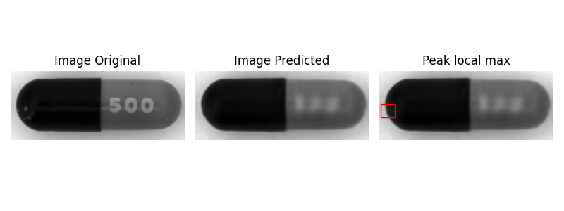
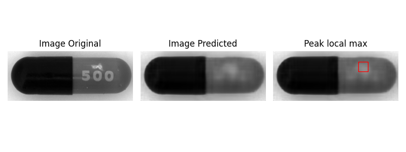
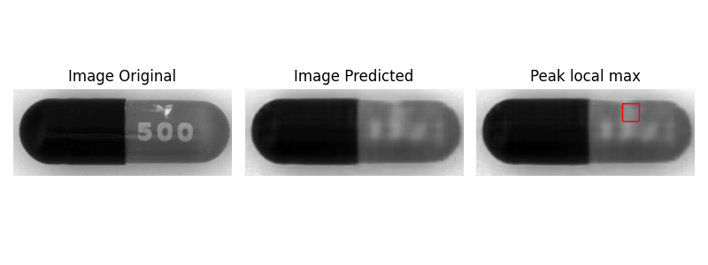
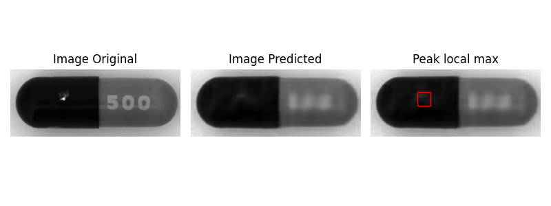
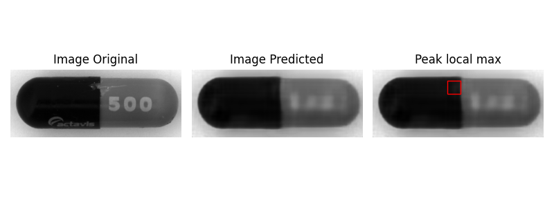

# Anomaly detection using autoencoders.
## Introduction
This projects tries to detect anomalies in pharmaceutical capsule images using Encoder/Decoder model.
## Technologies
<ul>
  <li>Python</li>
  <li>Tensorflow</li>
  <li>Keras</li>
  <li>sklearn</li>
  <li>skimage</li>
  <li>Numpy</li>
  <li>Matplotlib</li>
</ul>

## Procedure
To solve the problem:
<ul>
  <li>Use N good images to train a encoder/decoder model.</li>
  <li>Chop the encoder layers and upload the weight generated in the first model.</li>
  <li>Fit kernel density model (KDE) with train images.</li>
  <li>Determine the KDE thresholds.</li>
  <li>Create an algorithm where input images that exceed the threshold are flagged.</li>
  <li>Take the flagged images and run it through an algorithm to determine the coordinates of peak_local_max.</li>
  <li>Plot anomaly images.</li>
</ul>

## Anomaly output image exampels

